# MaaSathi AI Code Analysis

This document is a code-driven walkthrough of the current MaaSathi AI repository. It is based on the implementation in the Flask backend, AI engine modules, and static frontend files.

## What The Project Is

MaaSathi AI is a full-stack assistant for mothers built as:

- A Flask backend in `backend/app.py`
- A local/static frontend in `frontend/`
- An AI layer in `ai_engine/`
- A local vector memory store using FAISS and Sentence Transformers
- A provider chain that prefers Groq, falls back to Ollama, and finally uses rule-based responses

The application supports:

- Registration and login with server-side sessions
- Dashboard overview metrics
- Task management
- Reminder management
- Meal saving and meal-plan generation
- Safety logs and SOS guidance
- General AI chat
- Energy-smart day planning

## Top-Level Structure

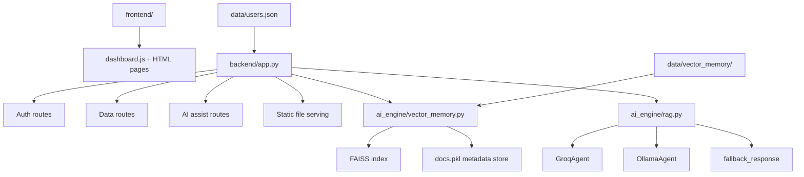

## Runtime Architecture

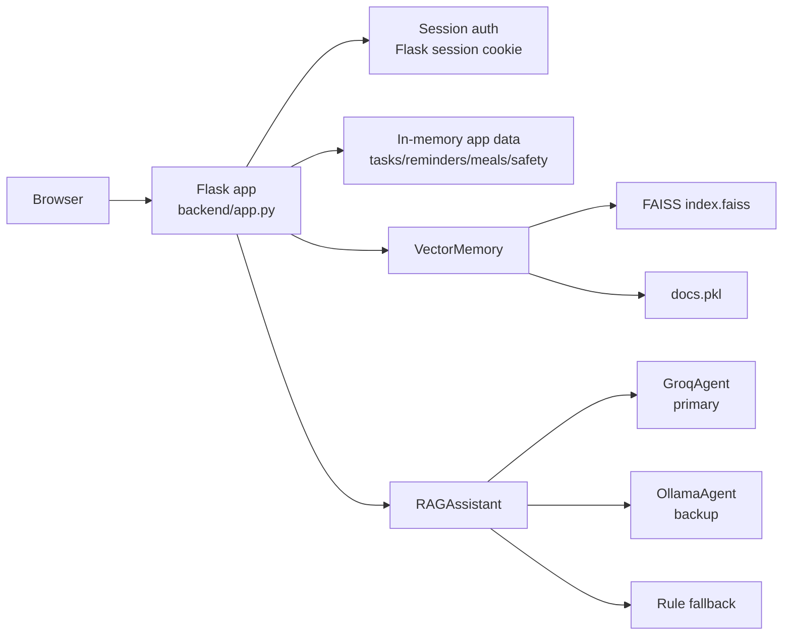

## Main Backend Responsibilities

The backend in `backend/app.py` is the central orchestrator.

- Serves `frontend/index.html` at `/`
- Serves other frontend files through `/<path:path>`
- Loads environment variables from the project root `.env`
- Creates the `data/` folder if missing
- Initializes vector memory at `data/vector_memory`
- Seeds vector memory from `ai_engine/sample_data.py` if the store is empty
- Keeps tasks, reminders, meals, and safety logs in process memory
- Stores registered users in `data/users.json`
- Uses Flask session cookies for authentication state

## Request/Response Layers

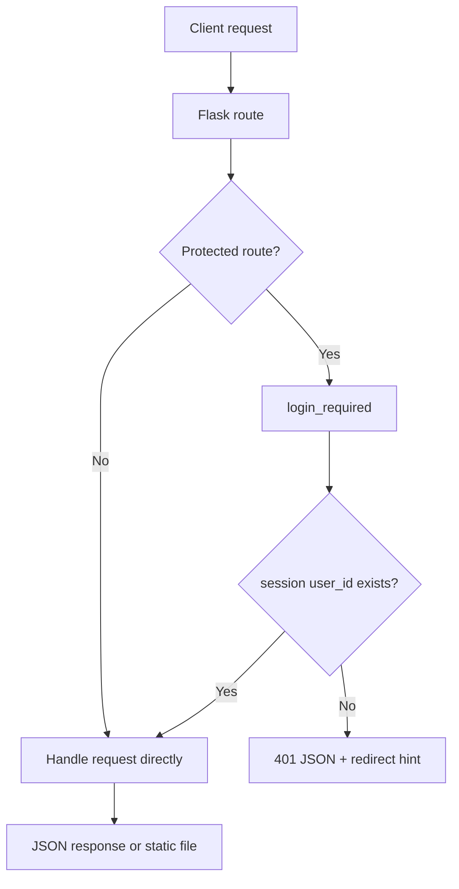

## Authentication Flow

Authentication is simple and file-backed.

- Users are stored by email in `data/users.json`
- Passwords are hashed with HMAC SHA-256 using a static salt string
- Successful register/login writes `user_id`, `user_email`, `user_name`, and `user_avatar` into session
- Protected API routes use the `login_required` decorator

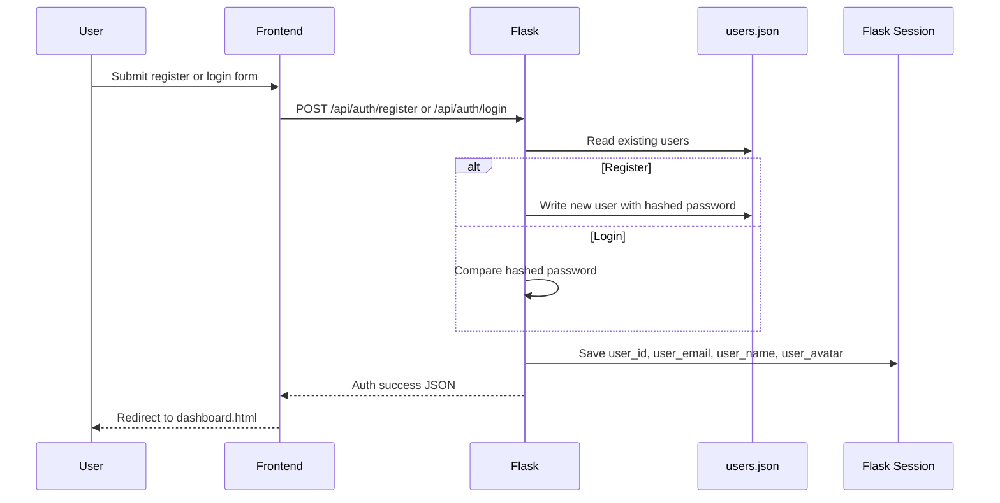

## API Surface

### Public routes

- `/`
- `/<path:path>`
- `POST /api/auth/register`
- `POST /api/auth/login`
- `POST /api/auth/logout`
- `GET /api/auth/me`

### Protected data routes

- `GET /api/overview`
- `GET, POST /api/tasks`
- `PATCH, DELETE /api/tasks/<task_id>`
- `GET, POST /api/reminders`
- `DELETE /api/reminders/<rem_id>`
- `GET, POST /api/meals`
- `GET /api/safety`
- `POST /api/safety/alert`

### Protected AI routes

- `POST /api/assist/task_balance`
- `POST /api/assist/meal_planner`
- `POST /api/assist/day_plan`
- `POST /api/chat`
- `GET /api/ai/status`

## Feature Map

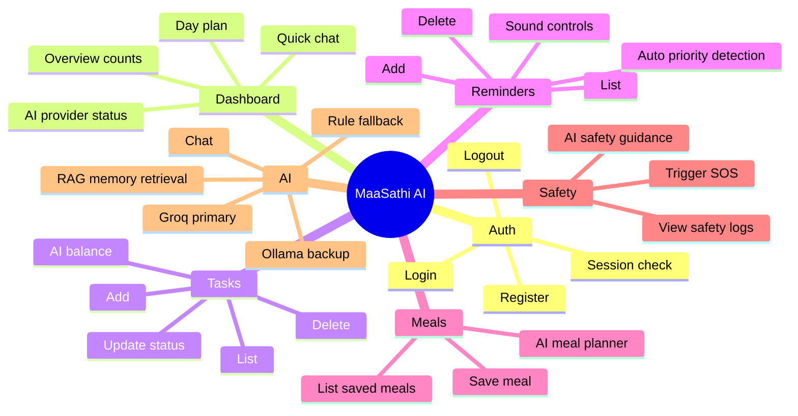

## Data Lifecycle

The project uses two different persistence styles:

- File-backed persistence for users and vector memory
- In-memory runtime collections for business objects

### Persisted data

- `data/users.json`
- `data/vector_memory/index.faiss`
- `data/vector_memory/docs.pkl`

### Non-persisted runtime collections

- `TASKS`
- `REMINDERS`
- `MEALS`
- `SAFETY_LOGS`

Those collections are initialized from `ai_engine/sample_data.py` and updated at runtime, but they are not written back to disk by the backend.

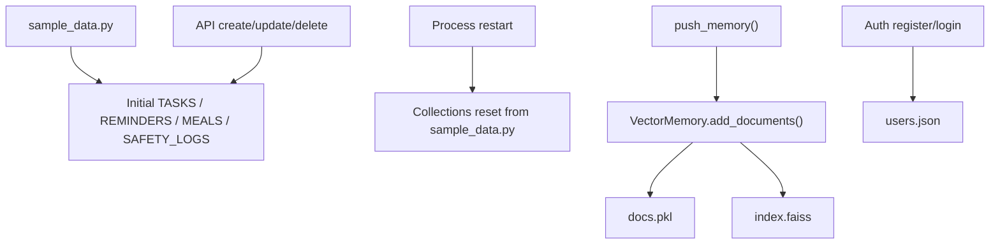

## AI Engine Design

The AI pipeline is implemented across:

- `ai_engine/rag.py`
- `ai_engine/vector_memory.py`
- `ai_engine/groq_agent.py`
- `ai_engine/ollama_agent.py`
- `ai_engine/fallback.py`

### Core idea

1. Retrieve relevant memory documents from FAISS
2. Build a purpose-specific prompt
3. Try Groq first
4. If Groq is unavailable or fails, try Ollama
5. If that still fails, use a rule-based fallback response

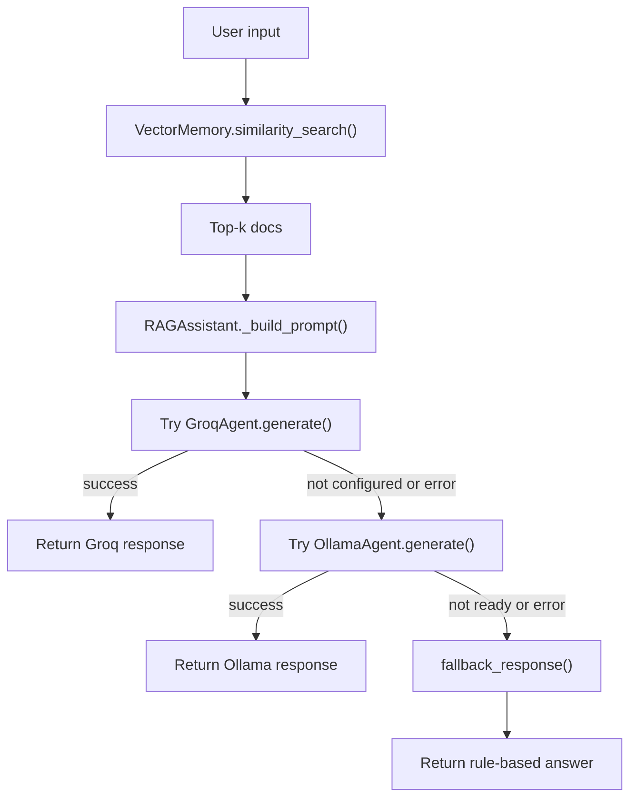

## Prompt Specialization

`RAGAssistant` changes prompt structure by `purpose`.

- `task_balance`
- `meal_planner`
- `safety`
- `day_plan`
- default `chat`

Each mode injects different extra context such as:

- current task inventory
- available ingredients
- safety message
- energy level, time available, and focus area

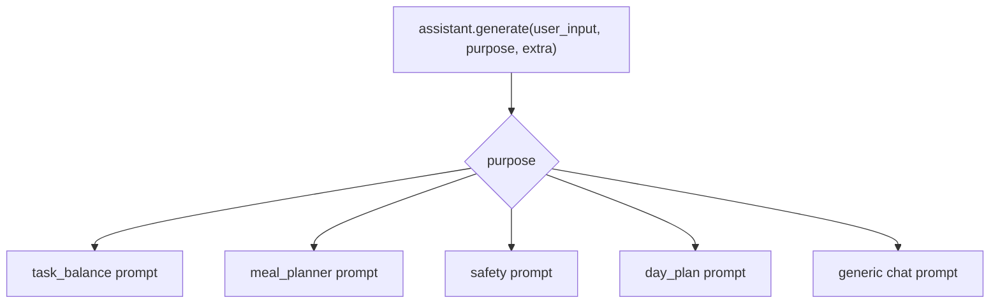

## Vector Memory Internals

`VectorMemory` uses:

- `SentenceTransformer("all-MiniLM-L6-v2")`
- FAISS `IndexFlatIP`
- Pickled document storage

Stored documents have the shape:

- `page_content`
- `metadata`

Chat history documents are compacted to keep them shorter.

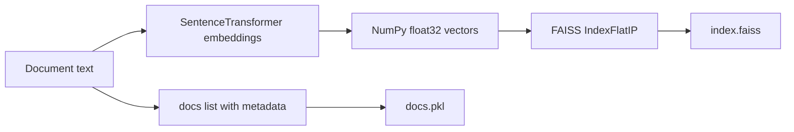

## Memory Write Triggers

The backend writes to vector memory when users perform important actions.

- New task added
- New reminder added
- New meal saved
- New day plan requested
- New safety alert triggered
- New chat exchange summarized

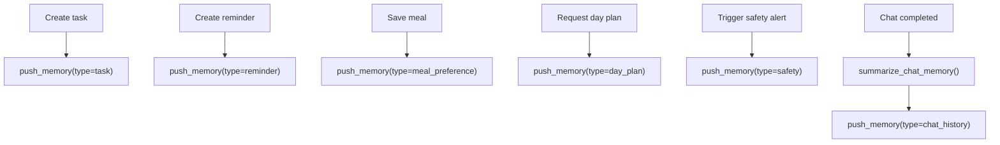

## Groq And Ollama Provider Chain

### Groq

- Uses the OpenAI-compatible Groq chat completions endpoint
- Requires `GROQ_API_KEY`
- Default model is `llama-3.1-8b-instant`
- Uses `requests.Session` with `trust_env = False`

### Ollama

- Connects to `http://127.0.0.1:11434`
- Default model preference starts with `phi3:latest`
- Detects installed local models via `/api/tags`
- Tries multiple candidate models in preference order
- Falls through if a model requires more memory

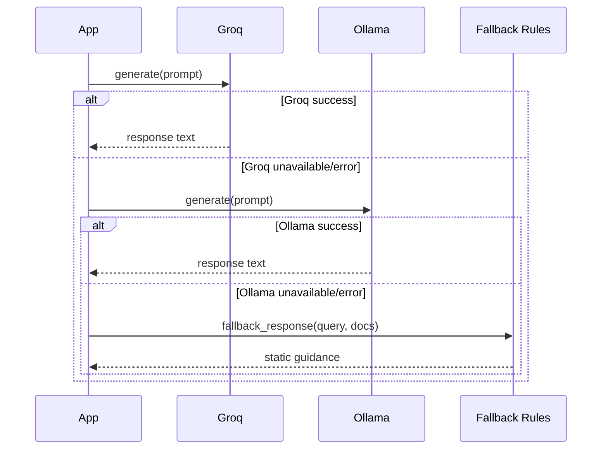

## Frontend Pages

The frontend is a static multi-page UI.

- `frontend/index.html` is the landing page
- `frontend/login.html` is the sign-in page
- `frontend/register.html` is the account creation page
- `frontend/dashboard.html` is the authenticated app

The backend serves these files directly from the `frontend/` directory.

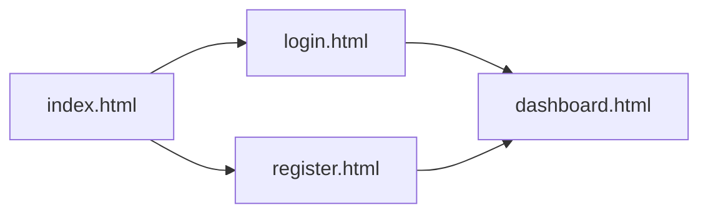

## Dashboard Frontend Logic

`frontend/dashboard.js` is the main client-side controller.

It handles:

- auth check on load
- sidebar navigation
- API calls with session cookies
- rendering lists and overview cards
- AI chat windows
- task/reminder/meal actions
- AI status polling every 30 seconds
- SOS flow
- reminder sound preferences in `localStorage`

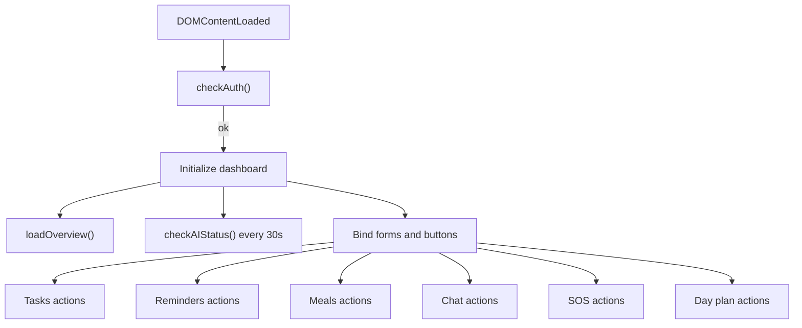

## Dashboard Interaction Map

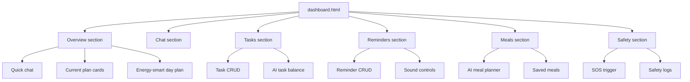

## Landing Page vs Dashboard Script

There are two different frontend JavaScript paths:

- `frontend/dashboard.js` is the active authenticated dashboard logic
- `frontend/script.js` appears to be an older or alternate script for a simpler UI flow

`script.js` still references endpoints like:

- `/overview`
- `/chat`
- `/assist/task_balance`

Those are appended to `http://127.0.0.1:5000/api`, so they still resolve correctly, but the current main dashboard experience is clearly built around `dashboard.html` + `dashboard.js`.

## Important Implementation Observations

### 1. Tasks, reminders, meals, and safety logs are not persisted

Only users and vector memory survive restarts. The runtime collections are rebuilt from sample data every time the Flask app restarts.

### 2. Memory and visible business data can diverge

If a user adds tasks or reminders, those actions are written into vector memory and survive in `data/vector_memory/`, but the task and reminder lists themselves reset on restart.

### 3. The root landing page copy does not fully match the provider chain

`frontend/index.html` markets the app as fully local and Ollama-powered, while the actual code prefers Groq first and only then uses Ollama backup.

### 4. Authentication is simple but not production-grade

- Password hashing uses a fixed salt rather than per-user salts
- Users are stored in a flat JSON file
- Flask secret key has a development fallback value

### 5. The app is intentionally easy to demo

The seeded sample data, in-memory feature collections, and static frontend make it easy to run locally without setting up a database.

## End-To-End User Journey

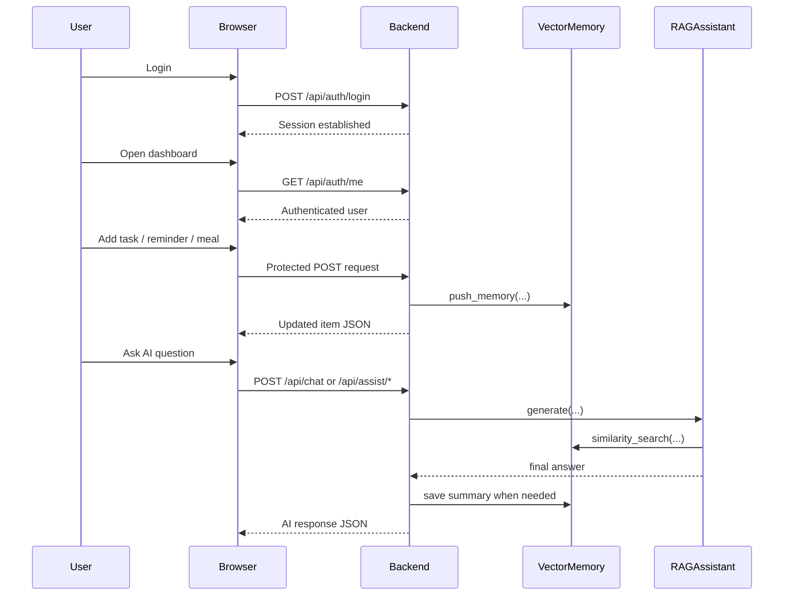

## File-Level Summary

- `backend/app.py`: Flask server, route definitions, auth/session handling, in-memory business state, AI entry points
- `ai_engine/rag.py`: prompt construction, memory retrieval, provider fallback sequence
- `ai_engine/vector_memory.py`: embeddings, FAISS storage, similarity search, compaction
- `ai_engine/groq_agent.py`: Groq HTTP client wrapper
- `ai_engine/ollama_agent.py`: Ollama model discovery and generation wrapper
- `ai_engine/fallback.py`: keyword-based rule responses
- `ai_engine/sample_data.py`: initial demo data and vector seed documents
- `frontend/dashboard.html`: main authenticated UI
- `frontend/dashboard.js`: dashboard behavior and API orchestration
- `frontend/index.html`: marketing/landing page
- `frontend/login.html`: login page
- `frontend/register.html`: registration page
- `frontend/script.js`: alternate or legacy simplified client flow

## Summary

MaaSathi AI is currently a Flask-based local-first demo application with a richer architecture than a basic CRUD dashboard:

- session-based auth
- static frontend delivery
- in-memory domain data
- persistent vector memory
- prompt-specialized RAG orchestration
- Groq primary inference
- Ollama local backup
- rule-based final fallback

The main architectural strength is the simple but effective AI pipeline. The main architectural limitation is that most user-facing business data is still volatile across server restarts.
